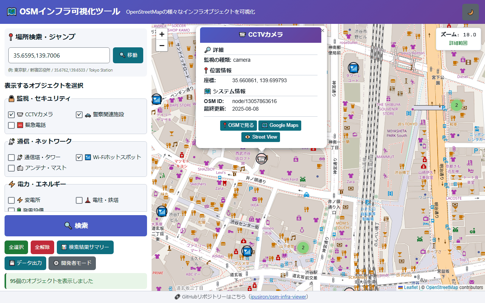
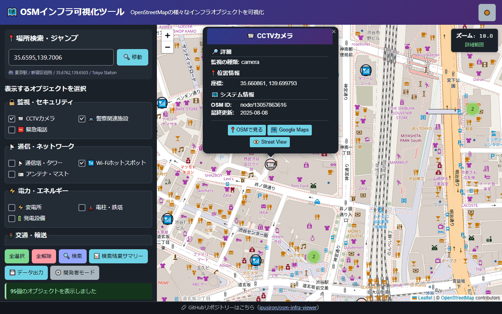
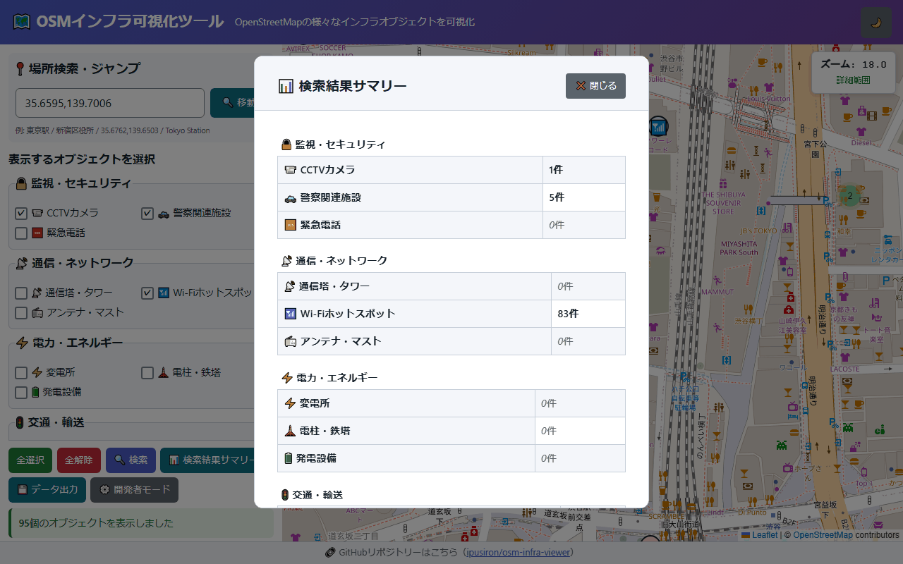
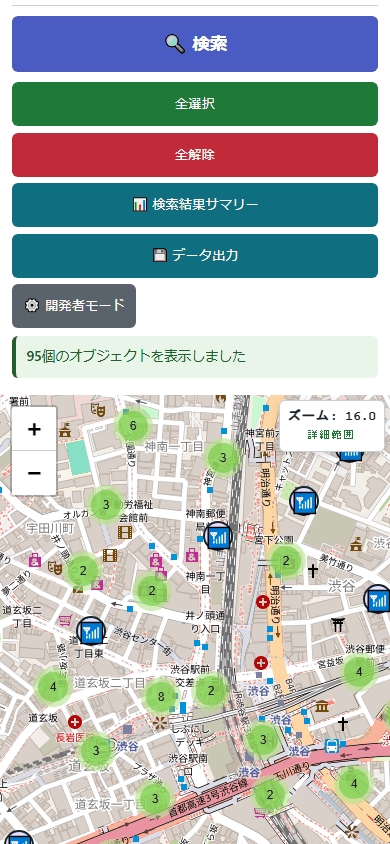

# OSM Infrastructure Viewer

English · [日本語](README.md)


[](https://ipusiron.github.io/osm-infra-viewer/)

**Day011 - 100 Security Tools with Generative AI**

OSM Infrastructure Viewer plots the infrastructure objects recorded in OpenStreetMap onto an interactive map.

It covers 21 kinds of objects, from CCTV cameras and towers to ATMs and hospitals. Results are grouped by the kinds you
picked at search time, and can be saved as GeoJSON or KML.

## 🌐 Demo

👉 [https://ipusiron.github.io/osm-infra-viewer/](https://ipusiron.github.io/osm-infra-viewer/)

## 📸 Screenshots

The screenshots below are taken from the running tool (Japanese UI).


> *The full-width search button with 95 real objects around Shibuya. A CCTV camera popup is open in light mode.*


> *The same results in dark mode. Map tile colors are left untouched.*


> *The result summary, counted against the kinds selected when the search ran.*


> *A 390px-wide stacked layout, framed so the search button, status line, and map are all visible.*

## ✨ Features

### 🗺️ Map and lookup

- **Interactive map**: responsive panning and zooming, built on Leaflet
- **Place lookup**: jump by address, place name, or latitude/longitude
- **Zoom readout**: shows how wide the current search area is
- **Marker clustering**: keeps large result sets usable
- **Japanese and English**: switch from the header button, with `?lang=ja` / `?lang=en`, or from your browser language

### 🔍 Search and filters

- **21 kinds of objects**: grouped into six categories in the selection panel
- **Multiple kinds at once**: pick only what you need
- **Live data**: fetched from the Overpass API, so you always see the current OSM data

### 📊 Analysis and export

- **Result summary**: counts per category and per kind
- **Export**: GeoJSON (for the web) and KML (for Google Earth). Kind names are written in the language on screen
- **Details**: tags, address, and outbound links for each object

### 🛠️ Developer features

- **Developer mode**: debug details and a jump to a fixed test spot
- **No area limit**: wide searches are allowed, with the performance caveats spelled out

## 🗂️ Infrastructure objects

### 🔒 Surveillance and security

| Object | OSM tag | Description |
|--------|---------|-------------|
| CCTV camera | `man_made=surveillance` | Surveillance cameras |
| Police facility | `amenity=police` | Police boxes and police stations |
| Emergency phone | `emergency=phone` | Phones for emergency calls |

### 📡 Communications and networks

| Object | OSM tag | Description |
|--------|---------|-------------|
| Tower | `man_made=communications_tower`, `man_made=tower` | Towers of all kinds, including observation towers and bell towers as well as communications towers. The kind is shown as "Tower kind" (tower:type) in the popup. man_made=communications_tower marks large towers over 100m |
| Wi-Fi hotspot | `internet_access=wlan` | Places offering Wi-Fi, such as cafes, shops, and public buildings |
| Mast or antenna | `man_made=mast`, `man_made=antenna` | Communication antennas |

### ⚡ Power and energy

| Object | OSM tag | Description |
|--------|---------|-------------|
| Substation | `power=substation` | Electrical substations |
| Power pole or pylon | `power=pole`, `power=tower` | Transmission infrastructure |
| Generator | `power=generator` | Generating equipment of any kind, including solar panels and wind turbines. The method is shown as "Energy source" in the popup |

### 🚦 Traffic and transport

| Object | OSM tag | Description |
|--------|---------|-------------|
| Traffic signals | `highway=traffic_signals` | Traffic lights |
| Speed camera | `highway=speed_camera` | Speed enforcement cameras |
| Fuel station | `amenity=fuel` | Refuelling stations |

### 🏢 Other infrastructure

| Object | OSM tag | Description |
|--------|---------|-------------|
| ATM | `amenity=atm` | Cash machines |
| Post box | `amenity=post_box` | Letter boxes |
| Waste disposal | `amenity=waste_disposal` | Medium to large waste containers and collection points, not treatment plants |

### 🏛️ Facilities and services

| Object | OSM tag | Description |
|--------|---------|-------------|
| Bank | `amenity=bank` | Financial institutions |
| Hospital | `amenity=hospital` | Medical institutions |
| School | `amenity=school` | Educational institutions |
| Restaurant | `amenity=restaurant` | Places to eat |
| Shop | `shop=supermarket`, `shop=convenience` | Retail shops |
| Parking | `amenity=parking` | Parking facilities |

When one element matches several kinds, the kinds you selected win, and within those the one higher in the table wins.

OSM tag names are proper nouns, so they are never translated. Only the descriptions and the interface text change with
the language.

## 📖 How to use

### The short version

1. Open the **[demo page](https://ipusiron.github.io/osm-infra-viewer/)**
2. **Choose an area**:
   - drag and zoom the map, or
   - type an address, place name, or coordinates into the place lookup
3. **Pick the kinds of objects** you want with the checkboxes
4. **Press "🔍 Search"** to fetch the data inside the current map view
5. **Read the results**: click a marker for its details

### Going further

#### 📍 Place lookup examples
```
Tokyo Station
Trafalgar Square
35.6762,139.6503
Brandenburger Tor
```

#### 📊 Analysis

- **"📊 Result summary"**: counts per category
- **"💾 Export"**: save as GeoJSON or KML

#### ⚙️ Developer mode

- **"⚙️ Developer mode"**: shows debug details and the test spot button

## 📐 Layout

From 1024px wide, the control panel sits on the left and the map on the right. Scrolling the list of kinds keeps the
search button and the status line pinned to the bottom.
Below 1024px the panel and the map stack vertically, and finishing a search scrolls the status line into view.
The language and theme buttons sit at the right edge of the header. The theme follows your operating system the first
time. The language comes from `?lang=ja` / `?lang=en`, then your saved choice, then your browser language.
Switching the language while results are on screen keeps the results and retranslates them in place.

## 🎯 Use cases

Ways of using this tool in particular

- Checking how your own shop or facility appears on a public map (shop and facility managers): the popup shows, as registered in OSM, the Wi-Fi SSID, the watched zone and form of a surveillance camera, and the opening hours. For example, a point whose SSID tag is Sakura_Free shows Sakura_Free in the SSID field. Sort out what you tell your customers anyway from what you would rather not show outside, and use it to review your notices and device settings (OSM is a map anyone can edit, and its policy is to record facts that can be checked on the ground. Use it to review your own side, not to remove what is recorded)
- Scouting before editing OSM (preparing a mapping party): the tool asks the Overpass API with `out center meta`, so the popup shows the last edit date and OSM ID of each point. Pick up points with an old last edit such as 2019-06-01, open the original data through the "📍 See on OSM" link, and make a list of places to check on the ground (old does not mean wrong; much equipment has not changed)
- Making a map for a disaster-preparedness walk (neighborhood associations and school lessons): select hospitals, police facilities, schools, fuel stations and shops (supermarkets and convenience stores), search, and save as KML; each point gets a name such as "Hospital: Sakura Hospital". Load it into Google My Maps or similar and use it to discuss evacuation routes or as a handout on the day (some facilities are missing from OSM, and evacuation shelters are not among the tool's 21 types; use it alongside your local hazard map and the list of shelters)

General uses

- Security research and audits: analysing camera placement, assessing exposure
- OSINT: gathering and analysing information about local infrastructure
- Urban planning and area surveys: infrastructure density, accessibility
- Teaching and demonstrations: a concrete example of using open data
- Research: visualising GIS data

- Surveillance analysis: how CCTV cameras and police facilities are distributed
- Infrastructure surveys: substations and poles, towers and places offering Wi-Fi
- Area profiling: banks and ATMs, access to hospitals and police facilities

## 🔬 How it is built

| Technology | Purpose | Version |
|------------|---------|---------|
| **HTML5/CSS3** | Interface and responsive layout | - |
| **JavaScript (ES6+)** | Application logic | - |
| **[Leaflet.js](https://leafletjs.com/)** | Interactive map | 1.9.4 |
| **[Leaflet.markercluster](https://github.com/Leaflet/Leaflet.markercluster)** | Marker clustering | 1.5.3 |
| **[Overpass API](https://overpass-api.de/)** | Querying OSM data | - |
| **[Nominatim API](https://nominatim.org/)** | Geocoding (address to coordinates) | - |
| **i18n.js** | Japanese and English text, and the switch between them | - |

### External dependencies

- OpenStreetMap tile servers
- Cloudflare CDN (library delivery)

### Query and classification

The kinds are defined once, in `OBJECT_TYPES` inside `osm-logic.js`. The 25 tags of the 21 kinds are processed in a fixed
order, and each tag produces one `nwr` statement. `nwr` covers nodes, ways, and relations, so hospitals and car parks
mapped as relations are found too.
The wording lives in `i18n.js`; `osm-logic.js` returns only keys (`labelKey`, `titleKey`, `headingKey`).

```text
[out:json][timeout:15];
(
  nwr["man_made"="surveillance"](35.65,139.69,35.67,139.71);
  nwr["internet_access"="wlan"](35.65,139.69,35.67,139.71);
);
out center meta;
```

If none of the selected kinds match, every kind is tried in table order. Elements matching nothing become "Other".
Elements without coordinates are left out of the map, the counts, and the export, and the summary reports how many were
skipped. Latitude 0 and longitude 0 are treated as valid coordinates.

The tile URL is `https://tile.openstreetmap.org/{z}/{x}/{y}.png` and the maximum zoom is 19. Tile colors and the colors
of the standard Leaflet controls are left alone.

### Handling responses

| Response | What the tool does |
|---|---|
| Success with one or more results | Reports how many objects are shown |
| Success with no results | Says nothing matched in this area |
| HTTP 200 with a remark containing "timed out" | The server ran out of its 15 seconds. Partial results are shown |
| Any other remark | Shows the warning text and any partial results |
| HTTP 429 | Rate limited. Wait about 30 seconds and search again |
| HTTP 504 (with HTML) | Busy. Not parsed as JSON; wait about 30 seconds and search again |
| Any other HTTP error | Shows the HTTP status |
| Invalid JSON, or `elements` not an array | Reported as an unexpected format |
| No response within 45 seconds | Aborted with AbortController; suggests a smaller area or waiting |
| Connection failure | Suggests checking the network |

Only success notices disappear, after five seconds. Warnings and errors stay until the next action, and the in-progress
notice stays until the search ends. Nothing is retried automatically.

## 🔒 Security and privacy

The tool talks to external services, so your search area and search terms are sent to the destinations below. Do not
type confidential or personal information into the lookup box.

| When | Destination | What is sent or fetched |
|---|---|---|
| On load | cdnjs.cloudflare.com | Five library files. Your IP address and origin |
| Every time the map is drawn or moved | tile.openstreetmap.org | Tile coordinates for the visible area, which reveal the region you are looking at |
| When you press Search | overpass-api.de | The latitude and longitude of the visible area, and the tags of the kinds you picked |
| When you look up a place name | nominatim.openstreetmap.org | The text you typed. Nothing is sent when you enter coordinates |
| Only when you follow a popup link | openstreetmap.org, google.com | The place or element the link points to |

Nothing stores your searches on a server of our own. Access logs on the services above follow each service's own policy.
The only values kept in browser localStorage are your theme and your language. Search terms, results, and the map
position are not stored.

- No API key needed
- No analytics, no tracking
- CSP limits scripts, styles, images, and connections. `'unsafe-inline'` and `'unsafe-eval'` are not used
- SRI verifies the five CDN files. Versions are Leaflet 1.9.4 and markercluster 1.5.3
- Rendering uses `createElement` and `textContent`. `innerHTML` is not used
- OSM element types and ids are validated before a link is built
- Outbound links carry `rel="noopener noreferrer"`
- The referrer policy is `strict-origin-when-cross-origin`. It is deliberately not `no-referrer`, because the OSM tile
  policy requires a valid Referer. Only the origin is sent, never the path or query

The CSP is declared in a meta tag. `frame-ancestors` has no effect in a meta tag, so it is omitted. GitHub Pages serves
static files without custom response headers, so this alone cannot prevent clickjacking.

### SRI hashes

The bytes of each delivered file are re-hashed with SHA-512 and checked.

| cdnjs file | integrity |
|---|---|
| `leaflet/1.9.4/leaflet.css` | `sha512-Zcn6bjR/8RZbLEpLIeOwNtzREBAJnUKESxces60Mpoj+2okopSAcSUIUOseddDm0cxnGQzxIR7vJgsLZbdLE3w==` |
| `leaflet/1.9.4/leaflet.min.js` | `sha512-puJW3E/qXDqYp9IfhAI54BJEaWIfloJ7JWs7OeD5i6ruC9JZL1gERT1wjtwXFlh7CjE7ZJ+/vcRZRkIYIb6p4g==` |
| `leaflet.markercluster/1.5.3/MarkerCluster.css` | `sha512-mQ77VzAakzdpWdgfL/lM1ksNy89uFgibRQANsNneSTMD/bj0Y/8+94XMwYhnbzx8eki2hrbPpDm0vD0CiT2lcg==` |
| `leaflet.markercluster/1.5.3/MarkerCluster.Default.css` | `sha512-6ZCLMiYwTeli2rVh3XAPxy3YoR5fVxGdH/pz+KMCzRY2M65Emgkw00Yqmhh8qLGeYQ3LbVZGdmOX9KUjSKr0TA==` |
| `leaflet.markercluster/1.5.3/leaflet.markercluster.min.js` | `sha512-TiMWaqipFi2Vqt4ugRzsF8oRoGFlFFuqIi30FFxEPNw58Ov9mOy6LgC05ysfkxwLE0xVeZtmr92wVg9siAFRWA==` |

## ⚠️ Cautions

### Appropriate use

- **Education and research**: intended for academic work and security education
- **Public data only**: nothing but public OSM data is used
- **Follow the law**: obey the laws and regulations that apply to you

### Not allowed

- **Unauthorised access**: preparing attacks or intrusions
- **Invasion of privacy**: anything that violates someone's privacy
- **Illegal acts**: crime or harassment

### Terms of the external services

- Nominatim allows at most one request per second. The page enforces a one-second gap and implements no autocomplete
- The Nominatim limit applies to the application as a whole, across all its users. A per-page gap cannot guarantee the
  total across tabs and users, so low-traffic interactive use is assumed. Heavier use needs a different setup
- The main Overpass instance suggests staying under 10,000 queries and 1GB per day
- After a 429 or a 504, wait about 30 seconds. This tool never retries by itself
- Wide searches easily hit the server's 15-second limit. Zoom in, or pick fewer kinds
- Standard OSM tiles are for ordinary interactive browsing. Bulk downloading, prefetching, and offline storage are not
  allowed

## 🧪 Tests

Run `npm test` with Node 22 or later. It uses `node --test`, and needs neither dependencies nor a network connection.
GitHub Actions runs it on every push and pull request. Besides the logic, the tests check the 21-row table in the README,
the checkboxes in the HTML, SRI, CSP, image references, color contrast, and the Japanese/English dictionaries.

```sh
npm test
```

## 🔗 References

- [OSM tile usage policy](https://operations.osmfoundation.org/policies/tiles/)
- [Nominatim usage policy](https://operations.osmfoundation.org/policies/nominatim/)
- [Overpass API commons](https://dev.overpass-api.de/overpass-doc/en/preface/commons.html)
- [OpenStreetMap copyright and attribution](https://www.openstreetmap.org/copyright)
- [ODbL 1.0](https://opendatacommons.org/licenses/odbl/1-0/)

## 📁 Directory structure

```text
osm-infra-viewer/
├── .github/workflows/test.yml  # Offline tests on Node 22
├── assets/
│   ├── favicon.svg           # Favicon
│   ├── screenshot2.png       # Light mode results
│   ├── screenshot3.png       # Dark mode results
│   ├── screenshot4.png       # Summary
│   └── screenshot5.png       # Mobile
├── test/
│   ├── fixture.json          # Fictional data for tests only (never used for screenshots)
│   ├── logic.test.js         # Expected values of the pure logic
│   ├── readme.test.js        # Documents, definitions, and image references
│   ├── html.test.js          # HTML, CSP, SRI
│   ├── script.test.js        # Static checks on rendering and network code
│   ├── i18n.test.js          # Dictionaries, data-i18n, and re-rendering from state
│   ├── contrast.test.js      # Contrast computed from the CSS
│   └── format.test.js        # Line length and readability
├── .gitignore                # Untracked files
├── index.html                # Control panel, map, dialogs
├── i18n.js                    # Japanese and English text, and the switch
├── osm-logic.js               # Pure logic, free of the DOM
├── script.js                  # DOM, Leaflet, and fetch
├── style.css                  # Layout, light and dark
├── package.json               # A test command and no dependencies
├── CLAUDE.md                  # Rules for development
├── README.md                  # Japanese README
├── README.en.md               # This file
└── LICENSE                    # MIT License
```

## 💻 Requirements

Use a modern browser that supports `<dialog>` and `100dvh` (2022 or later; older versions need updating).
Node 22 or later is needed only for the tests. The map and the search need an internet connection.

Locally, serve the files over HTTP and open the address it prints.

```sh
python -m http.server 8000 --bind 127.0.0.1
```

The tool also works from `file://`, but it cannot send a valid HTTP Referer there. To respect the OSM tile policy, serve
it over HTTP when you use the real services. The `file://` regression tests replace external responses with mocks.

## 📄 License

The tool itself is MIT licensed. See [LICENSE](LICENSE) for details.

The map data and the search results belong to OpenStreetMap contributors and follow ODbL 1.0. Attribution is required
when you redistribute an exported file too; the GeoJSON and KML output carries the attribution and license information.

## 🛠 About this tool

This tool is part of the "100 Security Tools with Generative AI" project, which builds and publishes a security-related
tool every day for 100 days, with the help of AI.

For the project and the other tools, see the page below.

🔗 [https://akademeia.info/?page_id=42163](https://akademeia.info/?page_id=42163)
