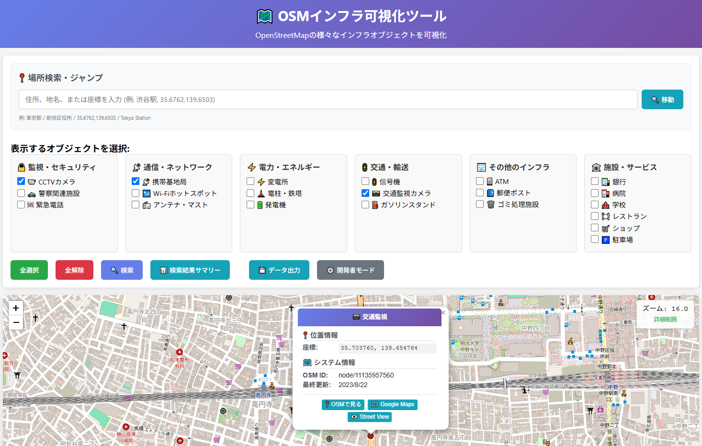

<!--
---
id: day011
slug: osm-infra-viewer

title: "OSM Infrastructure Viewer"

subtitle_ja: "OSMインフラ可視化ツール"
subtitle_en: "OpenStreetMap Infrastructure Visualization Tool"

description_ja: "OSM（OpenStreetMap）に登録されたCCTVカメラ、携帯基地局、ATMなど20種類以上のインフラオブジェクトを地図上に可視化するWebアプリケーション"
description_en: "A web application that visualizes 20+ infrastructure objects registered in OpenStreetMap, including CCTV cameras, cell towers, ATMs, and more on an interactive map"

category_ja:
  - OSINT
  - 地理情報
category_en:
  - OSINT
  - Geospatial

difficulty: 1

tags:
  - OpenStreetMap
  - Leaflet
  - OSINT
  - GIS
  - Geolocation
  - Infrastructure

repo_url: "https://github.com/ipusiron/osm-infra-viewer"
demo_url: "https://ipusiron.github.io/osm-infra-viewer/"

hub: true
---
-->

# OSMインフラ可視化ツール（OSM Infrastructure Viewer）

[](https://github.com/ipusiron/osm-infra-viewer/stargazers)
[](https://github.com/ipusiron/osm-infra-viewer/network/members)
[](https://opensource.org/licenses/MIT)
[](https://leafletjs.com/)
[](https://ipusiron.github.io/osm-infra-viewer/)

## 📌 概要

**Day 11 - 生成AIで作るセキュリティツール100**

OSMインフラ可視化ツール（OSM Infrastructure Viewer） は、OSM（OpenStreetMap）に登録された多種多様なインフラ系オブジェクトを地図上に可視化する高機能Webアプリケーションです。

CCTVカメラから携帯基地局、ATM、病院まで、20種類以上のインフラオブジェクトをワンクリックで検索・表示できます。

### 🎯 主な用途

このツールは、以下のような用途に活用できます。

- セキュリティ研究・監査: 監視カメラ配置の分析、脆弱性評価
- OSINT（オープンソース情報収集）: 地域インフラの情報収集・分析
- 都市計画・地域調査: インフラ密度の分析、アクセシビリティ評価
- 教育・デモンストレーション: オープンデータ活用の実例紹介
- 研究・学術: 地理情報システム（GIS）データの可視化研究

## 🌐 デモページ

👉 [https://ipusiron.github.io/osm-infra-viewer/](https://ipusiron.github.io/osm-infra-viewer/)

## 📸 スクリーンショット

以下は実際の画面例です。

>
>
> *検索結果のマーカーをポップアップ*

## ✨ 主な機能

### 🗺️ 地図・検索機能
- **インタラクティブ地図**: Leafletベースの軽快な操作性
- **場所検索・ジャンプ**: 住所、地名、座標（緯度経度）による位置検索
- **ズームレベル表示**: リアルタイムで検索範囲の状況を表示
- **マーカークラスター**: 大量データの効率的な表示

### 🔍 検索・フィルター
- **20種類以上のオブジェクト対応**: カテゴリ別に整理された選択UI
- **複数オブジェクト同時検索**: 必要な種別のみを選択して効率的に検索
- **リアルタイムデータ取得**: Overpass API経由で最新のOSMデータを取得

### 📊 データ分析・出力
- **検索結果サマリー**: カテゴリ別・種別別の件数統計
- **データエクスポート**: GeoJSON（Web用）・KML（Google Earth用）形式に対応
- **詳細情報表示**: 各オブジェクトの属性情報、住所、外部リンク

### 🛠️ 開発者機能
- **デバッグモード**: 開発者向けの詳細情報・テスト機能
- **制限なし検索**: 広範囲検索にも対応（性能への配慮あり）

## 🗂️ 対応インフラオブジェクト

### 🔒 監視・セキュリティ
| オブジェクト | OSMタグ | 説明 |
|--------------|---------|------|
| CCTVカメラ | `man_made=surveillance` | 監視カメラ |
| 警察関連施設 | `amenity=police` | 交番、警察署 |
| 緊急電話 | `emergency=phone` | 緊急通報用電話 |

### 📡 通信・ネットワーク
| オブジェクト | OSMタグ | 説明 |
|--------------|---------|------|
| 携帯基地局 | `man_made=communications_tower`, `man_made=tower` | 通信タワー |
| Wi-Fiホットスポット | `internet_access=wlan` | 無線LANアクセスポイント |
| アンテナ・マスト | `man_made=mast`, `man_made=antenna` | 通信アンテナ |

### ⚡ 電力・エネルギー
| オブジェクト | OSMタグ | 説明 |
|--------------|---------|------|
| 変電所 | `power=substation` | 電力変電施設 |
| 電柱・鉄塔 | `power=pole`, `power=tower` | 送電インフラ |
| 発電機 | `power=generator` | 非常用発電設備等 |

### 🚦 交通・輸送
| オブジェクト | OSMタグ | 説明 |
|--------------|---------|------|
| 信号機 | `highway=traffic_signals` | 交通信号 |
| 交通監視カメラ | `highway=speed_camera` | 速度違反取締カメラ |
| ガソリンスタンド | `amenity=fuel` | 燃料補給施設 |

### 🏢 その他のインフラ
| オブジェクト | OSMタグ | 説明 |
|--------------|---------|------|
| ATM | `amenity=atm` | 現金自動預払機 |
| 郵便ポスト | `amenity=post_box` | 郵便投函箱 |
| ゴミ処理施設 | `amenity=waste_disposal` | 廃棄物処理場 |

### 🏛️ 施設・サービス
| オブジェクト | OSMタグ | 説明 |
|--------------|---------|------|
| 銀行 | `amenity=bank` | 金融機関 |
| 病院 | `amenity=hospital` | 医療機関 |
| 学校 | `amenity=school` | 教育機関 |
| レストラン | `amenity=restaurant` | 飲食店 |
| ショップ | `shop=supermarket`, `shop=convenience` | 小売店 |
| 駐車場 | `amenity=parking` | 駐車施設 |

## 🚀 使用方法

### 基本的な使い方

1. **[デモページ](https://ipusiron.github.io/osm-infra-viewer/)** にアクセス
2. **場所を指定**:
   - 地図をドラッグ・ズームして範囲を調整
   - または「場所検索」に住所・地名・座標を入力
3. **オブジェクト種別を選択**: チェックボックスで表示したい種別を選択
4. **「🔍 検索」ボタンをクリック**: 現在の地図範囲内のデータを取得
5. **結果を確認**: マーカーをクリックして詳細情報を表示

### 高度な使い方

#### 📍 場所検索の例
```
東京駅
新宿区役所
35.6762,139.6503
Tokyo Station
```

#### 📊 データ分析
- **「📊 検索結果サマリー」**: カテゴリ別統計の確認
- **「💾 データ出力」**: GeoJSON/KML形式でのエクスポート

#### ⚙️ 開発者モード
- **「⚙️ 開発者モード」**: デバッグ情報の表示、テスト機能の利用

## 🔧 技術スタック

| 技術・ライブラリ | 用途 | バージョン |
|------------------|------|------------|
| **HTML5/CSS3** | UI構築・レスポンシブデザイン | - |
| **JavaScript (ES6+)** | アプリケーションロジック | - |
| **[Leaflet.js](https://leafletjs.com/)** | インタラクティブ地図表示 | 1.9.4 |
| **[Leaflet.markercluster](https://github.com/Leaflet/Leaflet.markercluster)** | マーカークラスター機能 | 1.5.3 |
| **[Overpass API](https://overpass-api.de/)** | OSMデータクエリ | - |
| **[Nominatim API](https://nominatim.org/)** | ジオコーディング（住所→座標変換） | - |

### 外部依存関係
- OpenStreetMapタイルサーバー
- Cloudflare CDN（ライブラリ配信）

## 📁 プロジェクト構成

```
osm-infra-viewer/
├── index.html          # メインアプリケーション
├── script.js           # JavaScriptロジック
├── style.css           # スタイルシート
├── README.md          # このファイル
└── LICENSE            # MITライセンス
```

## 🔐 セキュリティ・プライバシー

### セキュリティ機能
- **HTMLエスケープ**: XSS攻撃対策
- **完全クライアントサイド**: サーバーサイドでのデータ保存なし
- **HTTPS通信**: 外部API通信の暗号化

### プライバシー保護
- **APIキー不要**: 個人情報の登録・送信なし
- **ローカル処理**: ブラウザ内でのみデータ処理
- **No tracking**: アクセス解析・追跡機能なし

## 🎓 OSINT・セキュリティ研究での活用例

### 監視システム分析
```javascript
// CCTVカメラと警察施設の分布を同時に調査
// 都市部の監視密度分析に活用
```

### インフラ脆弱性評価
```javascript
// 電力インフラ（変電所、電柱）の配置確認
// 通信インフラ（基地局、Wi-Fi）のカバレッジ分析
```

### 地域特性調査
```javascript
// 金融機関（銀行、ATM）の分布
// 緊急対応インフラ（病院、警察）のアクセシビリティ
```

## 🚨 利用上の注意

### 適切な利用
- **教育・研究目的**: 学術研究、セキュリティ教育での利用を推奨
- **公開データ**: OSMの公開データのみを使用
- **法令遵守**: 各国の法律・規制に従った利用

### 禁止事項
- **不正アクセス**: システムへの攻撃や不正侵入の準備
- **プライバシー侵害**: 個人のプライバシーを侵害する利用
- **違法行為**: 犯罪や迷惑行為への利用

## 📄 ライセンス

MIT License - 詳細は [LICENSE](LICENSE) ファイルを参照してください。

## このツールについて

本ツールは、「生成AIで作るセキュリティツール100」プロジェクトの一環として開発されました。 このプロジェクトでは、AIの支援を活用しながら、セキュリティに関連するさまざまなツールを100日間にわたり制作・公開していく取り組みを行っています。

プロジェクトの詳細や他のツールについては、以下のページをご覧ください。

🔗 [https://akademeia.info/?page_id=42163](https://akademeia.info/?page_id=42163)
