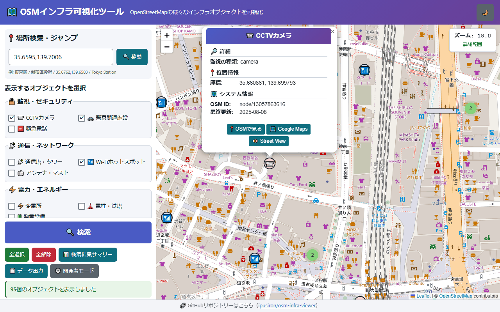
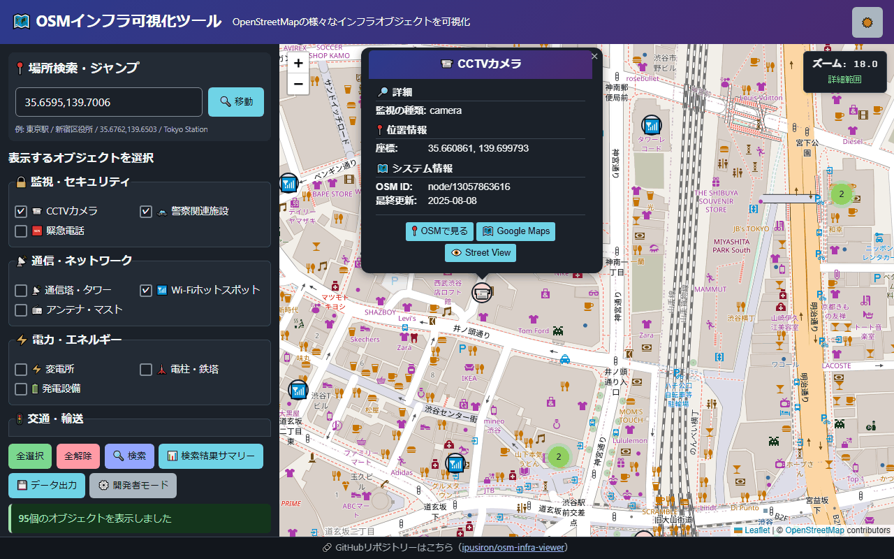
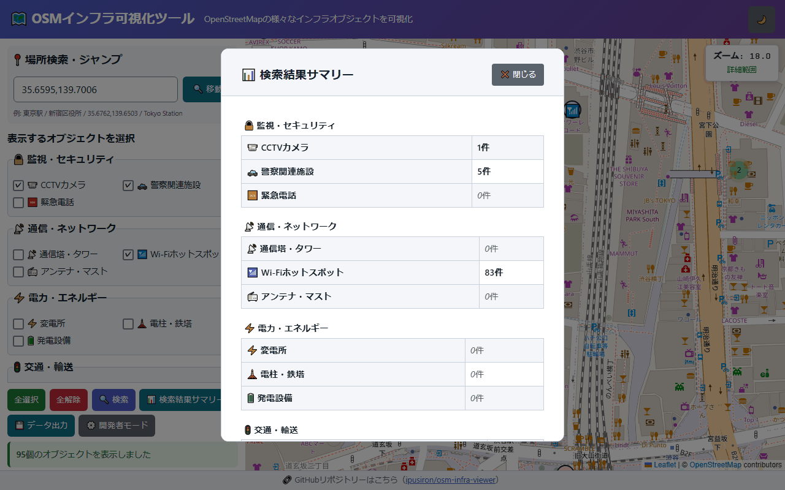
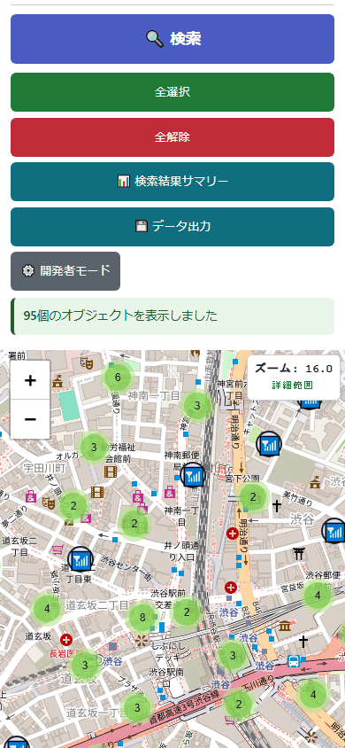

<!--
---
id: day011
slug: osm-infra-viewer

title: "OSM Infrastructure Viewer"

subtitle_ja: "OSMインフラ可視化ツール"
subtitle_en: "OpenStreetMap Infrastructure Visualization Tool"

description_ja: "OSM（OpenStreetMap）に登録されたCCTVカメラ、通信塔、ATMなど20種類以上のインフラオブジェクトを地図上に可視化するWebアプリケーション"
description_en: "A web application that visualizes 20+ infrastructure objects registered in OpenStreetMap, including CCTV cameras, communication towers, ATMs, and more on an interactive map"

category_ja:
  - OSINT
  - 地理情報
category_en:
  - OSINT
  - Geospatial

difficulty: 1

tags:
  - OpenStreetMap
  - Leaflet
  - OSINT
  - GIS
  - Geolocation
  - Infrastructure

repo_url: "https://github.com/ipusiron/osm-infra-viewer"
demo_url: "https://ipusiron.github.io/osm-infra-viewer/"

hub: true
---
-->

# OSM Infrastructure Viewer - OSMインフラ可視化ツール


[](https://ipusiron.github.io/osm-infra-viewer/)

**Day011 - 生成AIで作るセキュリティツール100**

OSMインフラ可視化ツールは、OSM（OpenStreetMap）に登録された多種多様なインフラ系オブジェクトを地図上に可視化する高機能Webアプリケーションです。

CCTVカメラから通信塔・タワー、ATM、病院まで、21種別のインフラオブジェクトを検索・表示できます。結果は検索時の種別で分類し、GeoJSON・KMLで保存できます。

## 🌐 デモページ

👉 [https://ipusiron.github.io/osm-infra-viewer/](https://ipusiron.github.io/osm-infra-viewer/)

## 📸 スクリーンショット

以下は実際の画面例です。


> *全幅の検索ボタンと、渋谷周辺の実データ95件。CCTVカメラの詳細を表示したライトモード*


> *同じ検索結果のダークモード。地図タイルの色は変更しない*


> *検索時に選択した種別を基準に集計した検索結果サマリー*


> *幅390pxの縦積み表示。検索ボタン・ステータス・地図が見える位置で撮影*

## ✨ 機能

### 🗺️ 地図・検索機能

- **インタラクティブ地図**: Leafletベースの軽快な操作性
- **場所検索・ジャンプ**: 住所、地名、座標（緯度経度）による位置検索
- **ズームレベル表示**: リアルタイムで検索範囲の状況を表示
- **マーカークラスター**: 大量データの効率的な表示

### 🔍 検索・フィルター

- **21種別のオブジェクト対応**: カテゴリー別に整理された選択UI
- **複数オブジェクト同時検索**: 必要な種別のみを選択して効率的に検索
- **リアルタイムデータ取得**: Overpass API経由で最新のOSMデータを取得

### 📊 データ分析・出力

- **検索結果サマリー**: カテゴリー別・種別別の件数統計
- **データエクスポート**: GeoJSON（Web用）・KML（Google Earth用）形式に対応
- **詳細情報表示**: 各オブジェクトの属性情報、住所、外部リンク

### 🛠️ 開発者機能

- **デバッグモード**: 開発者向けの詳細情報・テスト機能
- **制限なし検索**: 広範囲検索にも対応（性能への配慮あり）

## 🗂️ 対応インフラオブジェクト

### 🔒 監視・セキュリティ

| オブジェクト | OSMタグ | 説明 |
|--------------|---------|------|
| CCTVカメラ | `man_made=surveillance` | 監視カメラ |
| 警察関連施設 | `amenity=police` | 交番、警察署 |
| 緊急電話 | `emergency=phone` | 緊急通報用電話 |

### 📡 通信・ネットワーク

| オブジェクト | OSMタグ | 説明 |
|--------------|---------|------|
| 通信塔・タワー | `man_made=communications_tower`, `man_made=tower` | 通信塔のほか、展望塔・鐘楼などを含む塔全般。種類はポップアップの「塔の種類」（tower:type）で確認。man_made=communications_towerは高さ100mを超える大型の通信塔 |
| Wi-Fiホットスポット | `internet_access=wlan` | Wi-Fiを提供している施設（カフェ・店舗・公共施設など） |
| アンテナ・マスト | `man_made=mast`, `man_made=antenna` | 通信アンテナ |

### ⚡ 電力・エネルギー

| オブジェクト | OSMタグ | 説明 |
|--------------|---------|------|
| 変電所 | `power=substation` | 電力変電施設 |
| 電柱・鉄塔 | `power=pole`, `power=tower` | 送電インフラ |
| 発電設備 | `power=generator` | 太陽光パネル・風力タービンを含む発電設備全般。方式はポップアップの「発電方式」で確認 |

### 🚦 交通・輸送

| オブジェクト | OSMタグ | 説明 |
|--------------|---------|------|
| 信号機 | `highway=traffic_signals` | 交通信号 |
| 速度違反取締カメラ | `highway=speed_camera` | 速度違反取締カメラ |
| ガソリンスタンド | `amenity=fuel` | 燃料補給施設 |

### 🏢 その他のインフラ

| オブジェクト | OSMタグ | 説明 |
|--------------|---------|------|
| ATM | `amenity=atm` | 現金自動預払機 |
| 郵便ポスト | `amenity=post_box` | 郵便投函箱 |
| ゴミ集積所 | `amenity=waste_disposal` | 中〜大型のゴミ容器・集積所。処理施設ではない |

### 🏛️ 施設・サービス

| オブジェクト | OSMタグ | 説明 |
|--------------|---------|------|
| 銀行 | `amenity=bank` | 金融機関 |
| 病院 | `amenity=hospital` | 医療機関 |
| 学校 | `amenity=school` | 教育機関 |
| レストラン | `amenity=restaurant` | 飲食店 |
| ショップ | `shop=supermarket`, `shop=convenience` | 小売店 |
| 駐車場 | `amenity=parking` | 駐車施設 |

同じ要素が複数の種別に当たるときは、検索時に選んだ種別を優先し、その中では表の上にあるものに分類します。

## 📖 使い方

### 基本的な使い方

1. **[デモページ](https://ipusiron.github.io/osm-infra-viewer/)** にアクセス
2. **場所を指定**:
   - 地図をドラッグ・ズームして範囲を調整
   - または「場所検索」に住所・地名・座標を入力
3. **オブジェクト種別を選択**: チェックボックスで表示したい種別を選択
4. **「🔍 検索」ボタンをクリック**: 現在の地図範囲内のデータを取得
5. **結果を確認**: マーカーをクリックして詳細情報を表示

### 高度な使い方

#### 📍 場所検索の例
```
東京駅
新宿区役所
35.6762,139.6503
Tokyo Station
```

#### 📊 データ分析

- **「📊 検索結果サマリー」**: カテゴリー別統計の確認
- **「💾 データ出力」**: GeoJSON/KML形式でのエクスポート

#### ⚙️ 開発者モード

- **「⚙️ 開発者モード」**: デバッグ情報の表示、テスト機能の利用

## 📐 画面構成

幅1024px以上では、左の操作パネルと右の地図を2カラムで表示します。操作パネルの種別一覧をスクロールしても、検索ボタンとステータスは下端に残ります。
幅1023px以下では操作パネル、地図の順に縦積みになり、検索が終了するとステータスへ移動します。
ヘッダー右端でテーマを切り替えられます。初回はOSの設定に従います。

## 🎯 ユースケース

このツールは、以下のような用途に活用できます。

- セキュリティ研究・監査: 監視カメラ配置の分析、脆弱性評価
- OSINT（オープンソース情報収集）: 地域インフラの情報収集・分析
- 都市計画・地域調査: インフラ密度の分析、アクセシビリティ評価
- 教育・デモンストレーション: オープンデータ活用の実例紹介
- 研究・学術: 地理情報システム（GIS）データの可視化研究

- 監視システム分析: CCTVカメラと警察関連施設の分布・監視密度の分析
- インフラ調査: 変電所・電柱の配置、通信塔・Wi-Fiを提供する施設の分布の確認
- 地域特性調査: 銀行・ATMの分布、病院・警察関連施設へのアクセスの確認

## 🔬 技術的な説明

| 技術・ライブラリー | 用途 | バージョン |
|------------------|------|------------|
| **HTML5/CSS3** | UI構築・レスポンシブデザイン | - |
| **JavaScript (ES6+)** | アプリケーションロジック | - |
| **[Leaflet.js](https://leafletjs.com/)** | インタラクティブ地図表示 | 1.9.4 |
| **[Leaflet.markercluster](https://github.com/Leaflet/Leaflet.markercluster)** | マーカークラスター機能 | 1.5.3 |
| **[Overpass API](https://overpass-api.de/)** | OSMデータクエリ | - |
| **[Nominatim API](https://nominatim.org/)** | ジオコーディング（住所→座標変換） | - |

### 外部依存関係

- OpenStreetMapタイルサーバー
- Cloudflare CDN（ライブラリー配信）

### クエリと分類

種別定義は`osm-logic.js`の`OBJECT_TYPES`に集約しています。21種別の25タグを固定順で処理し、各タグに対して`nwr`を1文生成します。`nwr`はnode・way・relationを対象とし、病院や駐車場などのrelationも取得します。

```text
[out:json][timeout:15];
(
  nwr["man_made"="surveillance"](35.65,139.69,35.67,139.71);
  nwr["internet_access"="wlan"](35.65,139.69,35.67,139.71);
);
out center meta;
```

検索時に選んだ種別が一致しなければ、全種別を表の順で調べます。どれにも当たらない要素は「その他」です。座標のない要素は描画・集計・出力から除外し、サマリーに除外件数を表示します。緯度0・経度0は有効な座標として扱います。

タイルURLは`https://tile.openstreetmap.org/{z}/{x}/{y}.png`、最大ズームは19です。タイルの色やLeaflet標準コントロールの配色は変更しません。

### 応答の扱い

| 応答 | 画面の案内・処理 |
|---|---|
| 正常・1件以上 | 表示したオブジェクト数を通知 |
| 正常・0件 | 該当するオブジェクトなし |
| HTTP 200のtimed outを含むremark | サーバー側の15秒で時間切れ。途中の結果があれば表示 |
| その他のremark | 警告本文を文字列として表示し、途中の結果も表示 |
| HTTP 429 | 利用制限。30秒ほど待って再検索 |
| HTTP 504（HTMLを含む） | 混雑。JSONとして読まず、30秒ほど待って再検索 |
| その他のHTTPエラー | HTTPステータスを表示 |
| 不正JSON・elementsが配列でない応答 | 想定外の形式として案内 |
| 45秒以内に応答なし | AbortControllerで中断し、範囲の縮小または待機を案内 |
| 接続失敗 | ネットワークの確認を案内 |

成功通知だけ5秒後に消えます。警告・エラーは次の操作まで残り、検索中の表示は終了まで残ります。自動リトライは行いません。

## 🔒 セキュリティ・プライバシー

外部サービスを利用するため、検索範囲や検索語は次の通信先へ送られます。機密情報・個人情報を検索語に入力しないでください。

| いつ | 通信先 | 送られる情報・取得するもの |
|---|---|---|
| 起動時 | cdnjs.cloudflare.com | ライブラリー5ファイルの取得。IPアドレスとオリジン |
| 地図の表示と移動のたび | tile.openstreetmap.org | 表示範囲のタイル座標。閲覧地域が分かる情報 |
| 検索ボタンを押したとき | overpass-api.de | 表示範囲の緯度経度と選んだ種別のタグ |
| 地名で場所検索したとき | nominatim.openstreetmap.org | 入力した検索語。座標入力のときは送信しない |
| ポップアップのリンクを押したときだけ | openstreetmap.org・google.com | リンク先の地点・要素 |

本ツール独自のサーバーに検索内容を保存する処理はありません。ただし、通信先のサービス側でのアクセスログの扱いは各サービスの方針に従います。
ブラウザーのlocalStorageに保存するのはテーマの設定値だけです。検索語・結果・地図の位置は保存しません。

- APIキー不要
- アクセス解析・追跡機能なし
- CSPでスクリプト・スタイル・画像・接続先を限定。`'unsafe-inline'`・`'unsafe-eval'`は不使用
- SRIで既存CDNの5ファイルを検証。バージョンはLeaflet 1.9.4、markercluster 1.5.3
- `createElement`と`textContent`による描画。`innerHTML`不使用
- OSMの種別とIDを検証してリンクを作成
- 外部リンクに`rel="noopener noreferrer"`を付与
- referrerは`strict-origin-when-cross-origin`。OSMタイル利用規約が有効なRefererを求めるため、`no-referrer`にはしない。外部にはオリジンだけを送信し、パスやクエリは送信しない

CSPはmetaで指定しています。`frame-ancestors`はmetaでは無効なため含めていません。GitHub Pagesの静的配信では独自のレスポンスヘッダーを設定できず、この仕組みだけではクリックジャッキングを防げません。

### SRIハッシュ

配信されたファイルのバイト列をSHA-512で再計算して確認します。

| cdnjsのファイル | integrity |
|---|---|
| `leaflet/1.9.4/leaflet.css` | `sha512-Zcn6bjR/8RZbLEpLIeOwNtzREBAJnUKESxces60Mpoj+2okopSAcSUIUOseddDm0cxnGQzxIR7vJgsLZbdLE3w==` |
| `leaflet/1.9.4/leaflet.min.js` | `sha512-puJW3E/qXDqYp9IfhAI54BJEaWIfloJ7JWs7OeD5i6ruC9JZL1gERT1wjtwXFlh7CjE7ZJ+/vcRZRkIYIb6p4g==` |
| `leaflet.markercluster/1.5.3/MarkerCluster.css` | `sha512-mQ77VzAakzdpWdgfL/lM1ksNy89uFgibRQANsNneSTMD/bj0Y/8+94XMwYhnbzx8eki2hrbPpDm0vD0CiT2lcg==` |
| `leaflet.markercluster/1.5.3/MarkerCluster.Default.css` | `sha512-6ZCLMiYwTeli2rVh3XAPxy3YoR5fVxGdH/pz+KMCzRY2M65Emgkw00Yqmhh8qLGeYQ3LbVZGdmOX9KUjSKr0TA==` |
| `leaflet.markercluster/1.5.3/leaflet.markercluster.min.js` | `sha512-TiMWaqipFi2Vqt4ugRzsF8oRoGFlFFuqIi30FFxEPNw58Ov9mOy6LgC05ysfkxwLE0xVeZtmr92wVg9siAFRWA==` |

## ⚠️ 注意

### 適切な利用

- **教育・研究目的**: 学術研究、セキュリティ教育での利用を推奨
- **公開データ**: OSMの公開データのみを使用
- **法令遵守**: 各国の法律・規制に従った利用

### 禁止事項

- **不正アクセス**: システムへの攻撃や不正侵入の準備
- **プライバシー侵害**: 個人のプライバシーを侵害する利用
- **違法行為**: 犯罪や迷惑行為への利用

### 外部サービスの利用規約

- Nominatimは最大1リクエスト/秒。ページ内で1秒以上の間隔を強制し、オートコンプリートは実装しない
- Nominatimの上限は全利用者を合計したアプリケーション全体が対象。ページ単位の制限だけでは複数タブ・複数利用者の合計を保証できないため、低トラフィックの対話的利用が前提。利用が増える場合は運用の見直しが必要
- Overpassメインインスタンスの利用目安は1日10,000クエリ未満・1GB未満
- 429や504の後は30秒ほど待機。本ツールは自動リトライなし
- 広範囲の検索はサーバー側の15秒で時間切れになりやすい。地図を拡大するか、種別を減らして再検索
- OSM標準タイルは通常の対話的閲覧に使用。大量取得・事前取得・オフライン保存は禁止

## 🧪 テスト

Node 22以上で`npm test`を実行します。`node --test`を使い、依存パッケージもネットワーク接続も不要です。
GitHub Actionsでpushとpull_requestのたびに自動実行します。ロジックの期待値に加え、READMEの21種別の表、HTMLのチェックボックス、SRI、CSP、画像参照、配色のコントラストも検証します。

```sh
npm test
```

## 🔗 参考

- [OSMタイル利用規約](https://operations.osmfoundation.org/policies/tiles/)
- [Nominatim利用規約](https://operations.osmfoundation.org/policies/nominatim/)
- [Overpass APIの利用目安](https://dev.overpass-api.de/overpass-doc/en/preface/commons.html)
- [OpenStreetMapの著作権と帰属表示](https://www.openstreetmap.org/copyright)
- [ODbL 1.0](https://opendatacommons.org/licenses/odbl/1-0/)

## 📁 ディレクトリー構造

```text
osm-infra-viewer/
├── .github/workflows/test.yml  # Node 22でオフラインテスト
├── assets/
│   ├── favicon.svg           # ファビコン
│   ├── screenshot2.png       # ライトの検索結果
│   ├── screenshot3.png       # ダークの検索結果
│   ├── screenshot4.png       # サマリー
│   └── screenshot5.png       # モバイル
├── test/
│   ├── fixture.json          # テスト専用の架空データ（撮影には不使用）
│   ├── logic.test.js         # 純粋ロジックの期待値
│   ├── readme.test.js        # 文書・定義・画像参照の整合
│   ├── html.test.js          # HTML・CSP・SRI
│   ├── script.test.js        # 描画と通信処理の静的検証
│   ├── contrast.test.js      # CSSからのコントラスト計算
│   └── format.test.js        # 行長と可読性
├── .gitignore                # 追跡しないファイル
├── index.html                # 操作パネル・地図・ダイアログ
├── osm-logic.js               # DOM非依存の純粋ロジック
├── script.js                  # DOM・Leaflet・fetchの処理
├── style.css                  # レイアウト・ライト／ダーク
├── package.json               # 依存なしのテストコマンド
├── CLAUDE.md                  # 開発時のルール
├── README.md                  # このファイル
└── LICENSE                    # MITライセンス
```

## 💻 動作環境

`<dialog>`と`100dvh`に対応したモダンブラウザーを使用してください（2022年以降の対応版。古い版では更新が必要です）。
Node 22以上はテスト時だけ必要です。地図・検索にはインターネット接続が必要です。

ローカルでは次のようにHTTPで配信し、表示されたアドレスを開いてください。

```sh
python -m http.server 8000 --bind 127.0.0.1
```

`file://`でもアプリケーションの操作は動きますが、有効なHTTPのRefererを送れません。OSMタイルの利用規約に従うため、実サービスを使うときはHTTP配信を推奨します。file://の回帰テストは外部応答をモックに差し替えます。

## 📄 ライセンス

ツール本体はMITライセンスです。詳細は[LICENSE](LICENSE)をご覧ください。

地図データと検索結果はOpenStreetMap contributorsの著作物で、ODbL 1.0に従います。エクスポートしたファイルを再配布するときも帰属表示が必要です。GeoJSONとKMLには帰属・ライセンス情報を含めています。

## 🛠 このツールについて

本ツールは、「生成AIで作るセキュリティツール100」プロジェクトの一環として開発されました。 このプロジェクトでは、AIの支援を活用しながら、セキュリティに関連するさまざまなツールを100日間にわたり制作・公開していく取り組みを行っています。

プロジェクトの詳細や他のツールについては、以下のページをご覧ください。

🔗 [https://akademeia.info/?page_id=42163](https://akademeia.info/?page_id=42163)
